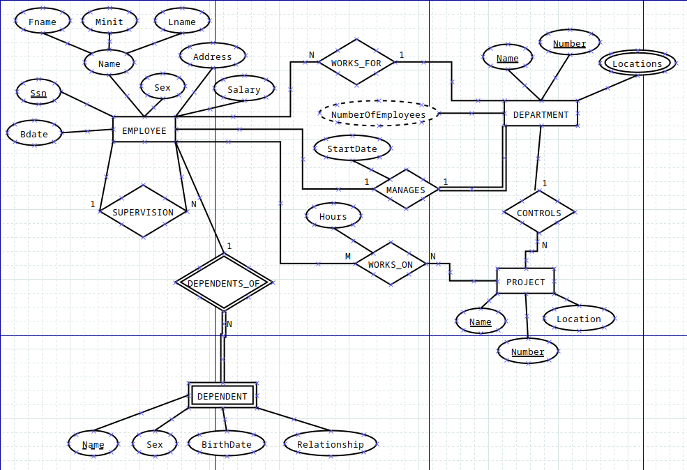

# API con Entity Framework en C# - Documentación

Este proyecto consiste en la creación de una API utilizando Entity Framework y C# para interactuar con una base de datos SQL Server. 

## Tecnologías Utilizadas

- **Entity Framework**: Framework de mapeo objeto-relacional (ORM) para .NET que simplifica el acceso y manipulación de datos en bases de datos relacionales.
- **C#**: Lenguaje de programación orientado a objetos ampliamente utilizado en el desarrollo de aplicaciones .NET.
- **SQL Server**: Sistema de gestión de bases de datos relacional desarrollado por Microsoft.


## Uso de la API
La API proporcionará endpoints para realizar operaciones CRUD (Crear, Leer, Actualizar, Eliminar) en las entidades Employee, Department, Project y Dependent. Algunos ejemplos de rutas podrían ser:

- GET `/api/employees`: Obtener todos los empleados.
- GET `/api/departments`: Obtener todos los departamentos.
- POST `/api/projects`: Crear un nuevo proyecto.
- PUT `/api/dependents/{id}`: Actualizar la información de un dependiente.

Además, se ha propuesto al menos una solicitud adicional que involucra un cálculo relacionado con el salario, proporcionando una funcionalidad extra que permite obtener información agregada sobre los salarios de los empleados en la base de datos.

---

## Uso de la API: Solicitudes Adicionales
### Cálculo del Costo Total del Proyecto

Esta API REST proporciona un punto final para calcular el costo total de un proyecto. El costo total se calcula sumando los salarios de todos los empleados asignados al proyecto.

#### Método HTTP y Ruta

- Método: GET
- Ruta: `/api/Projects/{projectName}/{projectNumber}/totalCost`

#### Parámetros de la Ruta

- `{projectName}`: El nombre del proyecto.
- `{projectNumber}`: El número del proyecto.

#### Respuesta Exitosa

En caso de una solicitud exitosa, el servidor responderá con un código de estado 200 (OK) y el costo total del proyecto en formato decimal.

Ejemplo de respuesta exitosa:

```json
150000
```

#### Respuestas de Error

- Código de estado 404 (Not Found): Si no se encuentra el proyecto con el nombre y número especificados en la base de datos.

#### Ejemplo de Uso

##### Solicitud

```
GET /api/Projects/Desarrollo/1003/totalCost
```

##### Respuesta

```
150000
```

Esta solicitud calcularía el costo total del proyecto con el nombre "Desarrollo" y el número 1003. En este ejemplo, el costo total del proyecto sería de 150,000 unidades monetarias.

--- 


La base de datos estará diseñada de acuerdo con el siguiente enunciado:

## Esquema de la Base de Datos

### Entidades

1. **Employee**:
   - Atributos:
     - Nombre (dividido en Fname, Minit y Lname)
     - Sexo
     - Dirección
     - Salario
     - SSN (Número de Seguro Social)
     - Fecha de nacimiento (Bdate)

2. **Department**:
   - Atributos:
     - Nombre
     - Número
     - Localizaciones
     - Número de empleados

3. **Project**:
   - Atributos:
     - Nombre
     - Número
     - Localización

4. **Dependent**:
   - Atributos:
     - Nombre
     - Sexo
     - Fecha de nacimiento
     - Relación

### Relaciones

1. **WorksFor**:
   - Descripción: Relación N:1 entre Employee y Department, donde un Employee trabaja para un Department y en un Department hay varios Employees.

2. **Manages**:
   - Descripción: Relación 1:1 entre Employee y Department con el atributo de startDate, donde un Employee gestiona un Department.

3. **WorksOn**:
   - Descripción: Relación N:N entre Employee y Project con el atributo de hours, donde un Employee trabaja en uno o varios Projects y un Project es trabajado por uno o varios Employees.

4. **Controls**:
   - Descripción: Relación 1:N entre Project y Department, donde un Project es controlado por un Department y un Department controla varios Projects.

5. **DependentsOf**:
   - Descripción: Relación 1:N entre Employee y Dependent, donde un Employee tiene uno o varios Dependents y un Dependent está asociado a un Employee.

6. **Supervision**:
   - Descripción: Relación reflexiva 1:N en Employee, donde un Employee supervisa a uno o varios Employees.


## Estructura del Proyecto

El proyecto estará estructurado de la siguiente manera:

```
- ProyectoAPI
  - Controllers/
    - EmployeeController.cs
    - DepartmentController.cs
    - ProjectController.cs
    - DependentController.cs
  - Models/
    - Employee.cs
    - Department.cs
    - Project.cs
    - Dependent.cs
  - Data/
    - DataContext.cs
  - Services/
    - EmployeeService.cs
    - DepartmentService.cs
    - ProjectService.cs
    - DependentService.cs
  - Migrations/
  - appsettings.json
  - ProyectoAPI.csproj
```

## Configuración de la Base de Datos

La configuración de la base de datos se realizará en el archivo `appsettings.json`, donde se especificarán los parámetros de conexión a la base de datos SQL Server.

```json
{
  "ConnectionStrings": {
    "DefaultConnection": "Server=localhost;Database=ProyectoDB;Trusted_Connection=True;"
  }
}
```

Se utilizarán las migraciones de Entity Framework para crear y actualizar la base de datos según los modelos definidos en el proyecto.

## Ejecución del Proyecto

Para ejecutar el proyecto, se puede utilizar Visual Studio o la línea de comandos. Si se utiliza la línea de comandos, se pueden ejecutar los siguientes comandos:

```bash
dotnet restore
dotnet ef database update
dotnet run
```

Esto restaurará las dependencias del proyecto, aplicará las migraciones pendientes para crear la base de datos y ejecutará la aplicación.

¡Bienvenido a la documentación de tu API con Entity Framework y C#! Este README proporciona una guía completa sobre cómo comenzar con el desarrollo de tu proyecto! Si necesitas más detalles sobre alguna parte en particular, no dudes en consultar la documentación oficial de las tecnologías utilizadas o hacerme cualquier pregunta adicional. ¡Buena suerte con tu proyecto!